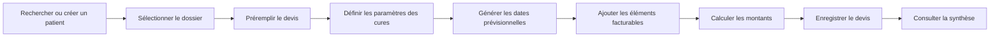
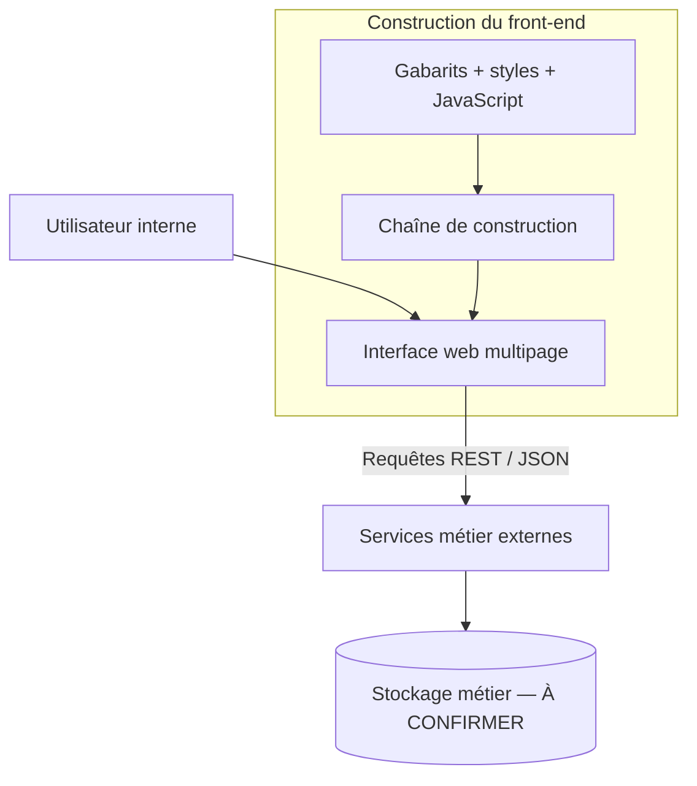

# Module de devis pour traitements organisés en cures

> Portfolio documentaire d'un projet de fin d'études — aucune donnée patient ni aucun code propriétaire.

## Présentation

Ce dépôt présente un **module web interne de préparation de devis pour des traitements organisés en cures**, réalisé dans le cadre d'un projet de fin d'études de licence à la Faculté des Sciences de Sfax, lors d'un stage chez Clinisys en 2024.

Le module s'intègre à une application hospitalière existante. Il accompagne un utilisateur interne depuis la sélection d'un dossier patient jusqu'à la préparation d'un devis comprenant un calendrier prévisionnel et des éléments facturables.

Il ne s'agit pas d'un portail patient, d'un dispositif médical, d'un outil de prescription ni d'un système de suivi clinique.

## Statut

| Élément | Statut documenté |
|---|---|
| Nature | Projet de fin d'études — documentation publique |
| Périmètre | Front-end intégré à une application existante |
| Année | 2024 |
| Validation métier | **À CONFIRMER** |
| Mise en production | **À CONFIRMER — non revendiquée** |
| Code source | Non publié — propriété de son titulaire |
| Données | Aucune donnée réelle publiée |

## Rôle personnel

Le périmètre personnel exact doit encore être validé par l'encadrement. À partir des éléments techniques disponibles, les contributions envisagées pour cette présentation sont :

- conception et intégration des interfaces de création et de consultation d'un devis ;
- génération d'un calendrier prévisionnel de cures ;
- ajout dynamique de catégories d'actes, d'examens et de produits ;
- calcul des quantités et montants côté interface ;
- intégration des écrans avec des API REST existantes ;
- adaptation du passage entre la sélection du patient et le devis.

> **À CONFIRMER :** attribution définitive de chacune de ces contributions, rôle dans les tests et éventuelle participation au backend.

## Fonctionnalités documentées

- sélectionner ou reprendre un dossier patient dans le parcours interne ;
- renseigner les informations générales du devis ;
- sélectionner les médecins associés ;
- définir le nombre de cures, leur durée et leur intervalle ;
- sélectionner les jours utiles et générer les dates prévisionnelles ;
- ajouter des examens, prestations, actes, produits et consommables ;
- saisir les quantités et calculer les montants ;
- transmettre les données à des services applicatifs ;
- consulter la synthèse d'un devis à partir de son numéro.

## Parcours principal

## Architecture

Le dépôt source analysé montre un client web multipage communiquant en JSON avec une API métier séparée. L'implémentation du serveur et le schéma de données ne font pas partie de cette publication.

Une présentation plus détaillée est disponible dans [docs/architecture.md](docs/architecture.md).

## Stack observée

- JavaScript, HTML5 et CSS3 ;
- Handlebars ;
- Bootstrap et jQuery ;
- Axios et API REST/JSON ;
- bibliothèque de manipulation de dates ;
- Gulp et Git.

Cette stack correspond au socle existant dans lequel le module a été intégré. Les technologies du backend et de la base sont **À CONFIRMER** avant publication.

## Captures et démonstration

Aucune capture réelle n'est publiée actuellement.

Les futures illustrations devront :

- utiliser exclusivement des données fictives ;
- porter visiblement la mention « DONNÉES FICTIVES » ;
- être recréées sans logo, nom de produit ou élément interne non autorisé ;
- être contrôlées pour retirer leurs métadonnées.

Les emplacements prévus sont décrits dans [docs/images/README.md](docs/images/README.md).

## Sécurité et confidentialité

Cette documentation ne revendique ni conformité réglementaire, ni sécurité complète. Elle distingue les mécanismes observés des mesures restant à vérifier.

Principales limites identifiées :

- backend et autorisations serveur non auditables depuis les éléments disponibles ;
- transfert temporaire de données côté navigateur à améliorer ;
- enregistrement composé de plusieurs opérations, sans transaction globale démontrée ;
- validation et gestion des erreurs à renforcer ;
- absence de tests automatisés dans la copie analysée ;
- dépendances historiques à auditer et mettre à niveau.

Voir [docs/security-and-limits.md](docs/security-and-limits.md).

## Plan d'amélioration

1. valider officiellement le périmètre personnel et le statut du projet ;
2. regrouper l'enregistrement du devis dans une transaction serveur ;
3. centraliser les échanges avec les services applicatifs ;
4. renforcer la validation et la gestion des erreurs ;
5. ajouter des tests sur les dates, les montants et les parcours principaux ;
6. auditer les dépendances et l'accessibilité ;
7. documenter une recette métier utilisant uniquement des données fictives.

## Perspectives

Les éléments suivants sont des **perspectives, non des fonctionnalités réalisées** : historique et statuts des devis, notifications internes, impression, interopérabilité avec le dossier patient et, après cadrage clinique et juridique, services destinés au patient.

## Documentation

- [Architecture](docs/architecture.md)
- [Sécurité et limites](docs/security-and-limits.md)
- [Preuves à réunir](docs/evidence-checklist.md)
- [Décisions d'architecture](docs/adr/README.md)
- [Règles pour les illustrations](docs/images/README.md)
- [Configuration GitHub proposée](docs/github-settings.md)

## Confidentialité et propriété

Ce dépôt ne contient ni code source de l'entreprise, ni URL ou infrastructure interne, ni information sur un client ou un collaborateur, ni donnée patient réelle. Les noms et marques appartiennent à leurs titulaires. Cette présentation personnelle n'est pas une communication officielle de Clinisys.

## Licence

Cette documentation est publiée sous le régime **tous droits réservés**. Elle n'accorde aucun droit sur le code, les marques ou les éléments appartenant à des tiers. Voir [LICENSE](LICENSE).

## Auteur

Khaled Zouari  
Licence — Faculté des Sciences de Sfax  
Projet de fin d'études — 2024
