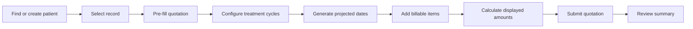
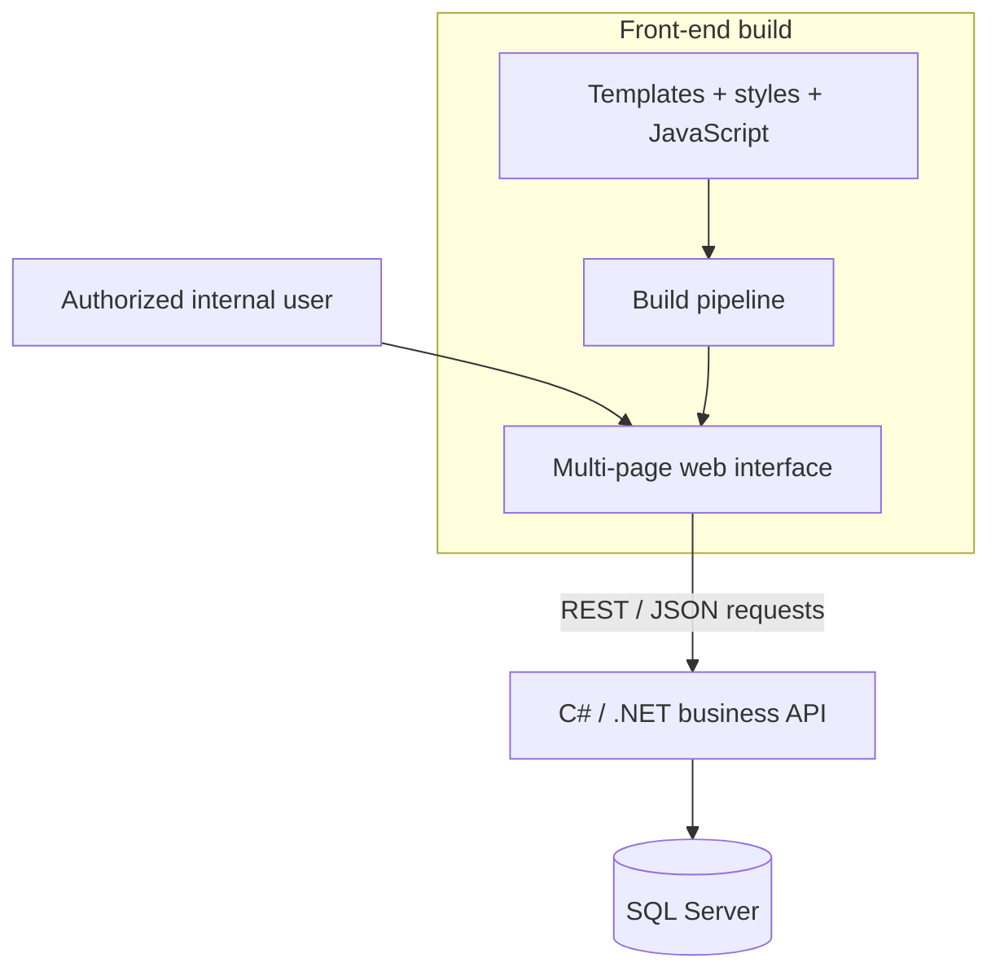
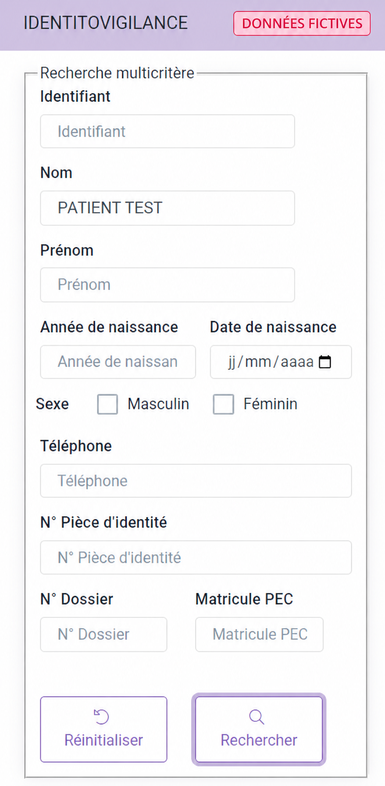
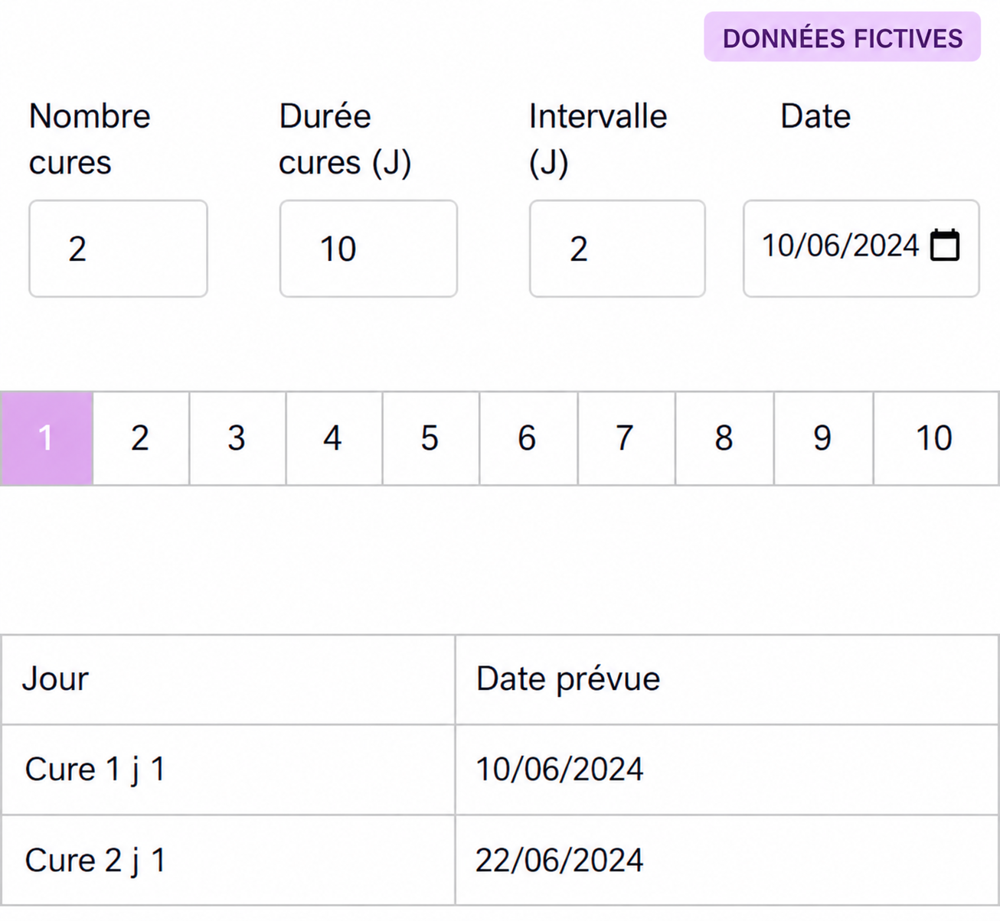
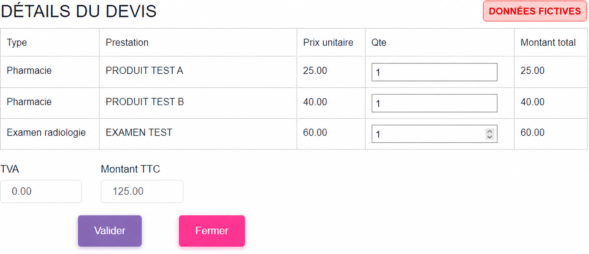

# Treatment-Cycle Quotation Module

> A documentation-first portfolio for a final-year software engineering project. It contains no patient data and no proprietary source code.

## Overview

This repository documents an **internal web module for preparing quotations for treatments organized into cycles**. The work was completed in 2024 as an undergraduate final-year project at the Faculty of Sciences of Sfax during an internship at Clinisys.

The module integrates into an existing hospital application. It guides an authorized internal user from patient-record selection through the preparation of a quotation containing a projected treatment schedule and billable items.

This project is not a patient portal, medical device, prescription tool, clinical decision-support system, or clinical monitoring system.

## Project status

| Item | Documented status |
| --- | --- |
| Project type | Final-year project; public documentation portfolio |
| Scope | Full-stack module integrated into an existing hospital application |
| Year | 2024 |
| Business acceptance | **To be confirmed** |
| Production deployment | **To be confirmed; not claimed** |
| Source code | Not published; owned by its rights holder |
| Data | No real patient data is published |

## Problem and objective

Preparing a treatment quotation requires coordinating administrative information, practitioners, recurring treatment dates, catalog items, quantities, and prices. The module brings those inputs into a guided workflow intended to reduce repetitive entry and provide a clear quotation summary before submission to the application's business services.

## Personal contribution

My confirmed scope covered both backend development and front-end integration:

- developing the backend services with C# and .NET;
- designing and integrating REST endpoints used by the quotation workflow;
- integrating persistence with SQL Server;
- designing and integrating quotation creation and lookup interfaces;
- generating a projected treatment-cycle calendar;
- dynamically adding procedures, examinations, products, and consumables;
- calculating quantities and displayed amounts in the interface;
- connecting patient selection to quotation preparation.

The company source code remains proprietary and is intentionally excluded from this public portfolio.

## Documented capabilities

- Select or resume a patient record within the internal workflow.
- Enter general quotation information and select associated practitioners.
- Define the number, duration, interval, and applicable weekdays of treatment cycles.
- Generate projected treatment dates.
- Add examinations, services, procedures, products, and consumables.
- Enter quantities and calculate displayed amounts.
- Submit prepared data to application services.
- Retrieve a quotation summary by its identifier.

## Core workflow

## Architecture at a glance

The implemented solution combines a multi-page web client with .NET business APIs and SQL Server persistence. Authentication details, the physical database schema, internal endpoints, and deployment infrastructure remain outside this public portfolio.

See the [detailed architecture](docs/architecture.md) for the inferred components, data flow, and limitations.

## Technology stack

| Area | Observed technologies |
| --- | --- |
| Backend | C#, .NET, REST APIs |
| Database | SQL Server |
| Languages | JavaScript, HTML5, CSS3 |
| Templates and UI | Handlebars, Bootstrap, jQuery |
| Integration | Axios, REST/JSON |
| Dates | Date manipulation and scheduling libraries |
| Tooling | Gulp, npm, Git |

The front end was implemented within the existing application foundation, while the module's backend services were developed with C#/.NET and integrated with SQL Server. No proprietary source code or internal configuration is included here.

## Interface previews

The following visuals are **anonymized reconstructions based on prototype screenshots**. They contain only fictitious data and reproduce no patient identity, employee identity, company logo, internal URL, or infrastructure detail.

### Multi-criteria search

Users can locate a record using multiple administrative search criteria.

### Projected treatment schedule

Users configure the cycle count, duration, interval, and applicable days to generate projected dates.

### Quotation details

Selected items are grouped with quantities, unit prices, and displayed amounts. Every amount shown is fictitious.

The publication safeguards are documented in the [illustration guidelines](docs/images/README.md).

## Security, privacy, and limitations

This portfolio does not claim regulatory compliance or complete application security. Public documentation cannot demonstrate every control present in the private application and its deployment environment.

Known limitations include:

- backend authorization and server-side validation cannot be audited here;
- temporary browser-side transfer of workflow data should be hardened;
- quotation submission appears to require multiple operations, with no demonstrated global transaction;
- validation, recovery, and user-facing error handling require strengthening;
- automated test coverage was absent from the original material reviewed for this portfolio;
- legacy dependencies require a security and compatibility audit.

See [Security and limitations](docs/security-and-limits.md) for the complete assessment.

## Improvement roadmap

1. Submit a quotation through a single transactional server-side operation.
2. Centralize API access and normalize error handling.
3. Enforce validation and authorization on the server as the source of truth.
4. Add automated tests for date generation, amount calculations, API contracts, and critical workflows.
5. Introduce versioned database migrations and deployment-safe rollback procedures.
6. Audit dependencies, accessibility, privacy, and browser compatibility.
7. Document business acceptance scenarios using fictitious data only.

Potential future capabilities—quotation history and status, internal notifications, printing, patient-record interoperability, and carefully governed patient services—are perspectives only and are not presented as implemented features.

## Documentation map

- [Architecture](docs/architecture.md) — inferred components, flows, and target architecture
- [Security and limitations](docs/security-and-limits.md) — risk boundaries and recommendations
- [Evidence checklist](docs/evidence-checklist.md) — claims that still require supporting evidence
- [Architecture Decision Records](docs/adr/README.md) — criteria for publishing verified decisions
- [Illustration guidelines](docs/images/README.md) — anonymization and publication controls
- [Proposed GitHub settings](docs/github-settings.md) — repository presentation recommendations

## Confidentiality and intellectual property

This repository contains no company source code, internal endpoint, infrastructure detail, customer or employee information, or real patient data. Names and trademarks remain the property of their respective owners. This personal portfolio is not an official Clinisys publication or product statement.

## License

The documentation is published under an **all rights reserved** model. It grants no rights to proprietary code, trademarks, or third-party material. See [LICENSE](LICENSE).

## Author

**Khaled Zouari** 
Undergraduate degree — Faculty of Sciences of Sfax 
Final-year project — 2024
