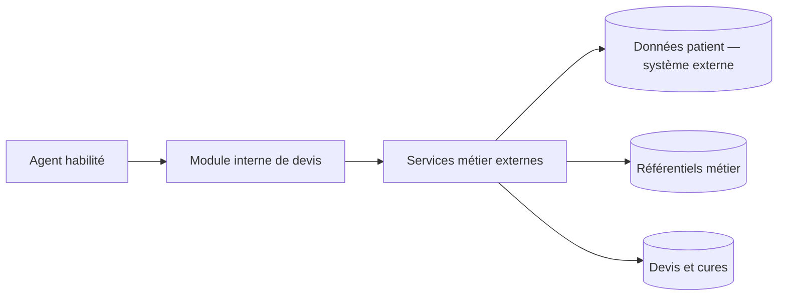
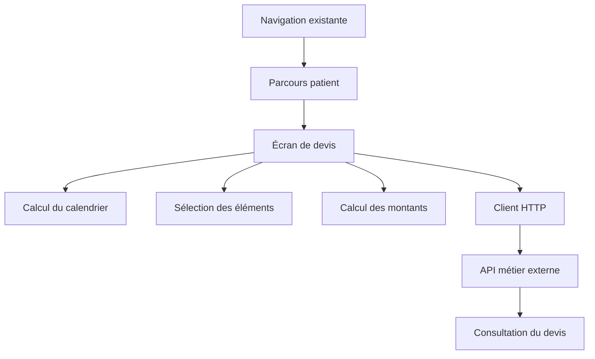
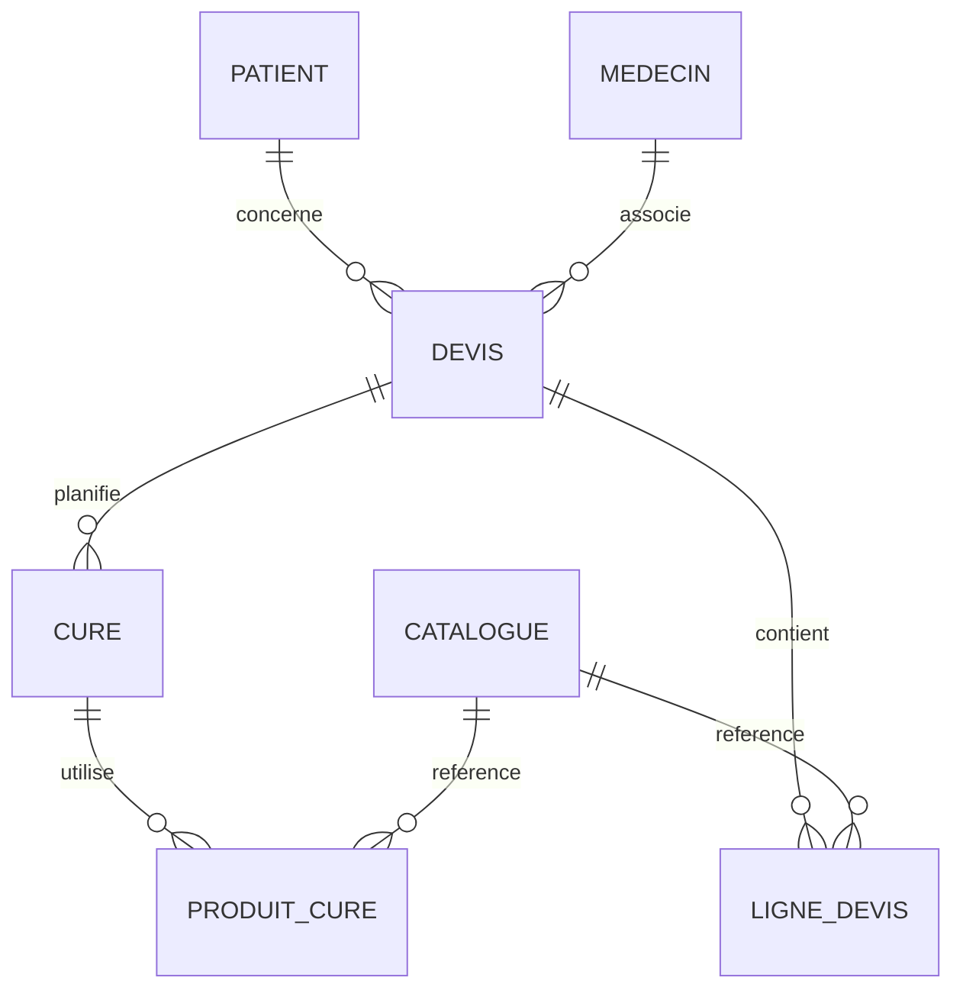
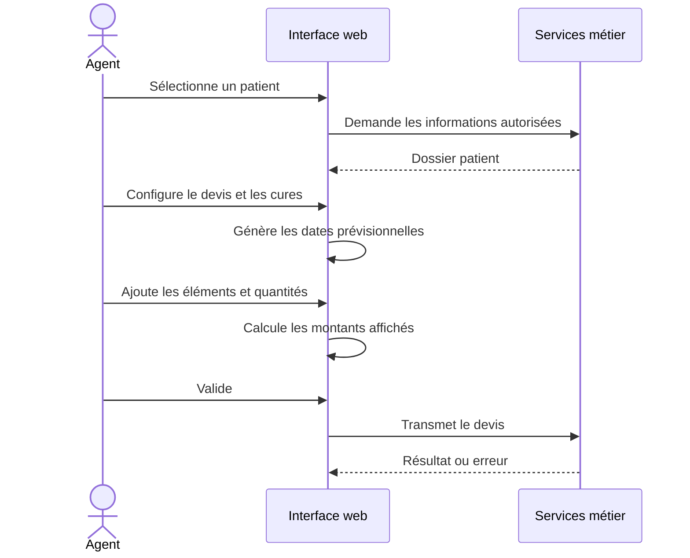
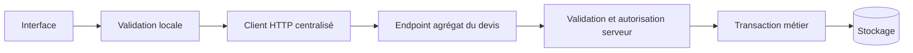

# Architecture du module

## Portée de cette description

Cette page décrit uniquement ce qui peut être déduit des éléments techniques disponibles. Elle ne révèle aucun endpoint, hôte, serveur, client ou composant interne de l'entreprise.

Le module est un front-end multipage intégré à une application hospitalière existante. Il consomme des services métier au format JSON. Le backend, l'authentification serveur, la base et l'infrastructure de déploiement ne sont pas inclus dans ce portfolio.

## Vue contextuelle

Les types de stockage, les frontières exactes des services et leur hébergement sont **À CONFIRMER**.

## Composants front-end

- **Parcours patient** : sélection ou création d'un dossier dans l'application interne.
- **Écran de devis** : informations générales, médecins et paramètres des cures.
- **Calcul du calendrier** : répétition des jours sélectionnés selon la durée et l'intervalle.
- **Catalogue** : catégories d'éléments facturables chargées depuis des services externes.
- **Montants** : quantité, prix et total calculés côté interface, à valider côté serveur.
- **Consultation** : affichage synthétique d'un devis identifié.

## Modèle logique déduit

Ce modèle est conceptuel. Il ne représente pas le schéma physique de l'entreprise.

Cardinalités, clés, champs et contraintes : **À CONFIRMER** avec une documentation autorisée du backend.

## Flux de préparation

## Choix techniques observés

L'utilisation de JavaScript, Handlebars, Bootstrap, jQuery et Gulp est vérifiable dans le socle analysé. Elle s'explique principalement par l'intégration dans une application existante. La décision personnelle de choisir ces technologies est **À CONFIRMER** ; elle ne doit pas être revendiquée sans preuve.

## Limites architecturales

- logique d'interface, calcul et accès réseau fortement couplés ;
- plusieurs opérations nécessaires pour enregistrer un même devis ;
- contrat et validation serveur non disponibles ;
- état transféré entre pages côté navigateur ;
- tests automatisés absents des éléments fournis.

## Architecture cible proposée

Cette cible constitue une recommandation, pas une réalisation du PFE :

Le serveur devrait rester la source de vérité pour les autorisations, tarifs, montants finaux et règles de cohérence.
