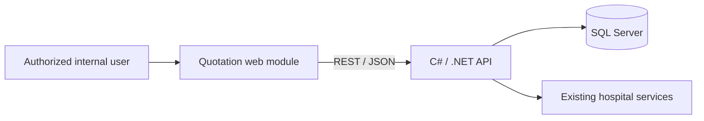
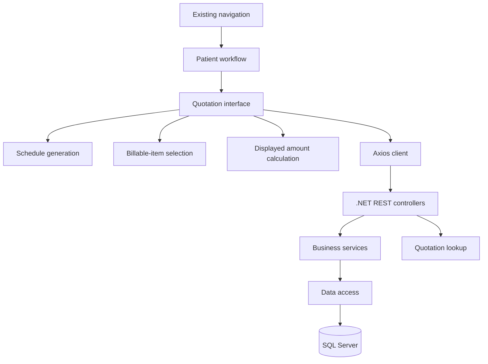
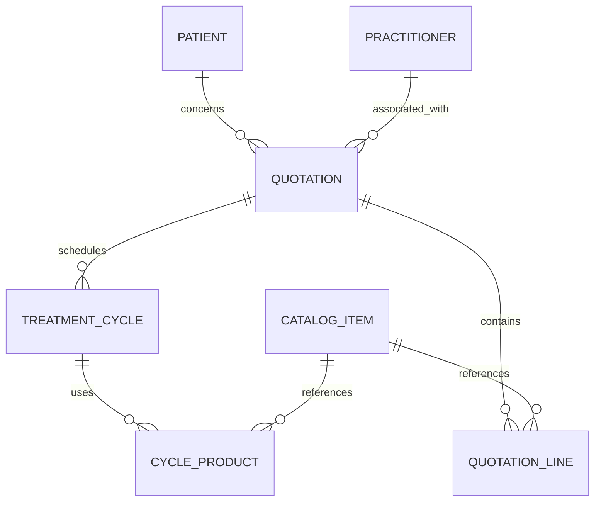
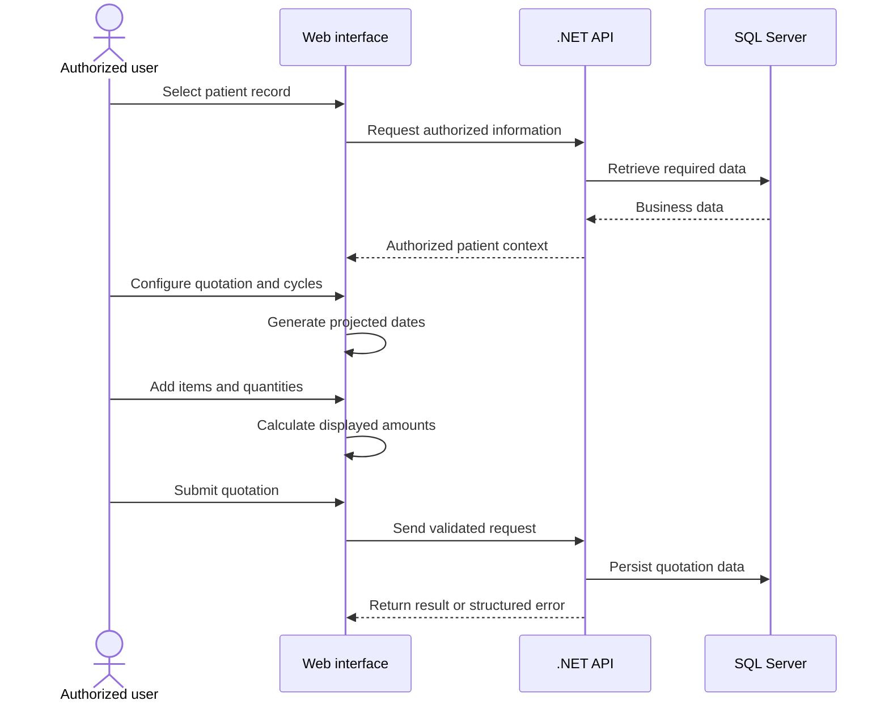
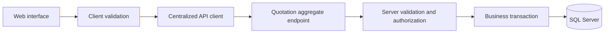

# Module Architecture

## Scope

This page documents the publishable architecture of the treatment-cycle quotation module. It intentionally excludes proprietary source code, internal endpoints, hostnames, infrastructure, credentials, and the physical database schema.

The solution is a full-stack module integrated into an existing hospital application. Its multi-page JavaScript interface communicates through REST/JSON with business services developed in C# and .NET, backed by SQL Server.

## System context

The exact service boundaries, hosting model, authentication infrastructure, and physical schema are deliberately not disclosed.

## Main components

- **Patient workflow:** selects or resumes a record in the existing application.
- **Quotation interface:** captures general information, practitioners, and treatment-cycle parameters.
- **Schedule generation:** calculates projected dates from duration, interval, and selected weekdays.
- **Billable-item selection:** loads procedures, examinations, services, products, and consumables.
- **Amount calculation:** provides immediate quantity, unit-price, and total feedback in the interface.
- **REST API:** validates requests and coordinates quotation business operations.
- **Persistence:** stores approved business data in SQL Server.
- **Quotation lookup:** retrieves a quotation summary by its identifier.

## Technology mapping

| Layer | Technologies |
| --- | --- |
| Interface | JavaScript, HTML5, CSS3, Handlebars |
| UI foundation | Bootstrap, jQuery |
| HTTP integration | Axios, REST/JSON |
| Front-end build | Gulp, npm |
| Backend | C#, .NET |
| Persistence | SQL Server |
| Version control | Git |

## Conceptual domain model

This model explains the business concepts without reproducing the company's physical database schema.

Cardinalities are illustrative and must not be treated as the proprietary physical schema.

## Quotation preparation sequence

## Architectural boundaries

- The server must remain the source of truth for authorization, prices, final amounts, and consistency rules.
- Client-side calculations are usability aids and require server-side verification.
- Sensitive patient information must be minimized in browser state and logs.
- Multi-step persistence should be protected by an appropriate transaction boundary.
- Error responses must avoid exposing internal implementation or sensitive data.

## Recommended evolution

Recommended next steps include a centralized API client, explicit DTO validation, transactional quotation submission, versioned database migrations, automated API and business-rule tests, structured observability, and documented rollback procedures.
